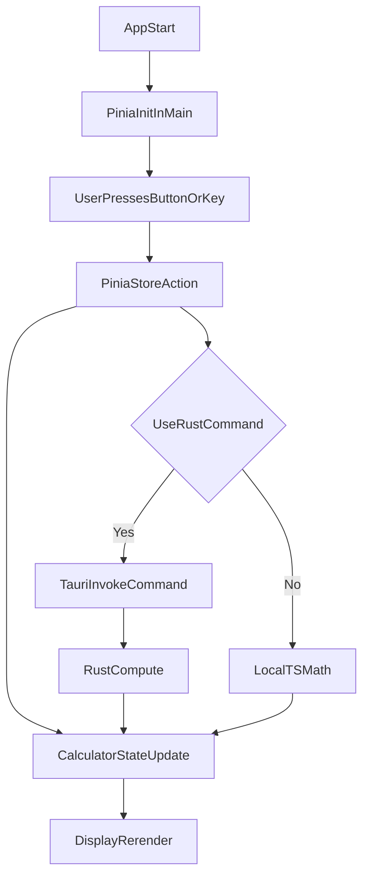

# Step-by-step Tauri Vue TS Calculator Plan

## Current Starting Point
- The app is scaffolded from Tauri + Vue template and still contains the greeting demo in [App.vue](/home/vlad/project/pets/simple-calculator/src/App.vue).
- Pinia is installed in [package.json](/home/vlad/project/pets/simple-calculator/package.json) but not initialized in [main.ts](/home/vlad/project/pets/simple-calculator/src/main.ts).
- Rust backend still exposes only `greet` command in [lib.rs](/home/vlad/project/pets/simple-calculator/src-tauri/src/lib.rs).

## Learning Roadmap (Incremental Milestones)
1. **Project cleanup and architecture setup**
   - Replace template UI with calculator skeleton.
   - Create folders for `components`, `stores`, and `types` to keep structure clear from day one.
   - Wire Pinia into app bootstrap in [main.ts](/home/vlad/project/pets/simple-calculator/src/main.ts).

2. **Calculator domain model first (before UI behavior)**
   - Define calculator state shape in a Pinia store: display value, previous value, operator, waiting-for-next-input flag, and optional error state.
   - Add pure store actions for number input, decimal input, operator selection, equals, clear, and sign toggle.
   - Keep math logic deterministic and testable (no DOM logic in store).

3. **Build UI as reusable Vue components**
   - Create `CalculatorScreen` for display and `CalculatorButton` for keys.
   - Build keypad layout in `App.vue` (or `CalculatorView.vue`) and map buttons to store actions.
   - Add keyboard support (0-9, operators, Enter, Backspace, Escape) to reinforce event-handling practice.

4. **Error handling and UX polish**
   - Handle edge cases: divide by zero, repeated equals, decimal duplicates, very long numbers.
   - Add responsive layout and accessible labels (aria text for keys).
   - Add dark/light style adjustments if desired.

5. **Optional Rust integration step (advanced learning)**
   - Keep core calculator local in TS first.
   - Then add one Tauri command in Rust (e.g., `calculate_expression`) and call it via `invoke` to learn frontend-backend bridge.
   - Compare local vs Rust-backed calculation paths.

6. **Packaging and release basics**
   - Validate dev/build commands, run production build, and create first desktop bundle via Tauri.
   - Update README with run/build instructions and feature checklist.

## Suggested File-by-File Implementation Order
- [src/main.ts](/home/vlad/project/pets/simple-calculator/src/main.ts): initialize Pinia with `createPinia()`.
- New store file (recommended `src/stores/calculator.ts`): central calculator logic and actions.
- [src/App.vue](/home/vlad/project/pets/simple-calculator/src/App.vue): replace template with calculator layout and bindings.
- Optional UI components under `src/components/`: button/display components for cleaner code.
- Optional backend extension in [src-tauri/src/lib.rs](/home/vlad/project/pets/simple-calculator/src-tauri/src/lib.rs): add extra command after TS-only version works.
- [README.md](/home/vlad/project/pets/simple-calculator/README.md): document milestones, commands, and known edge cases.

## Concept Flow Diagram

## Milestone Acceptance Checks
- Milestone 1: completed - app launches with clean calculator UI and no template greet logic.
- Milestone 2: completed - basic operations (`+`, `-`, `*`, `/`, `=`, `C`) work from buttons.
- Milestone 3: completed - keyboard input works and display updates predictably.
- Milestone 4: completed - divide-by-zero, repeated equals, and long-input edge cases are handled safely.
- Milestone 5 (optional): Rust command is called successfully from Vue.
- Milestone 6: app bundles successfully for desktop.
